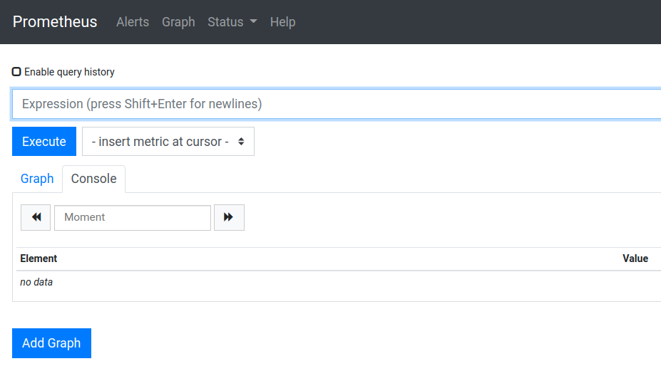
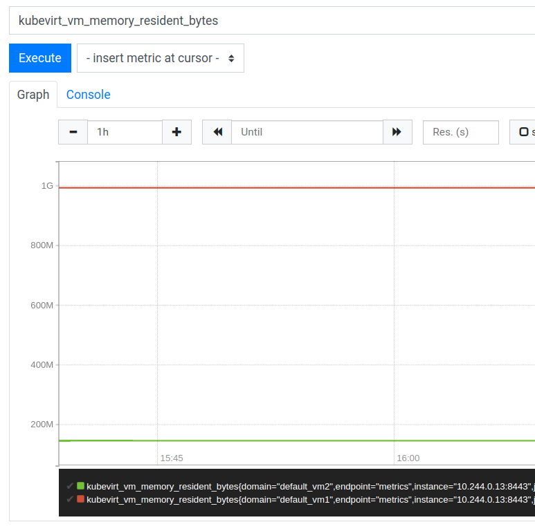
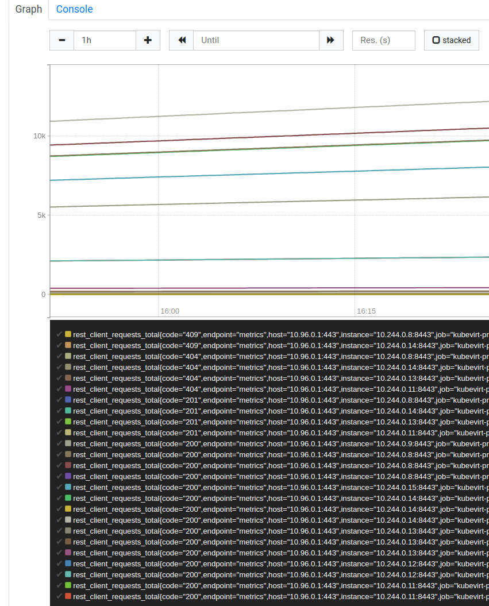
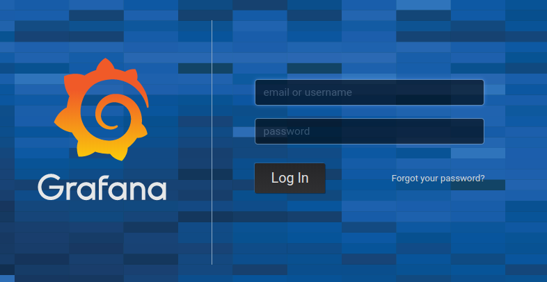
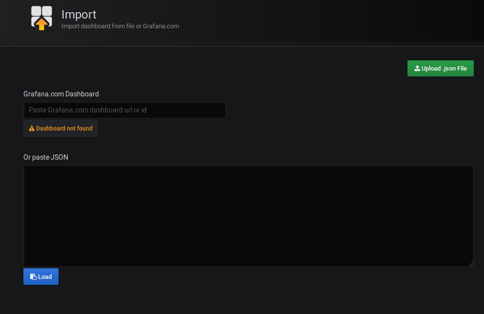
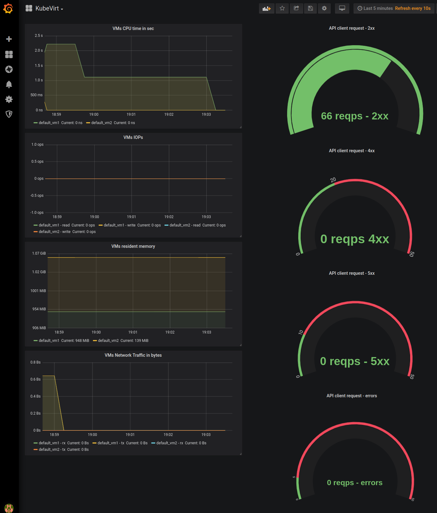

# Lab 9

## Exploring KubeVirt metrics

### Using the PromUI

Using your brower, head to head to your node's hostname on port 30090 to find the PromUI.



Metrics in KubeVirt can be differentiated in two types:

* Metrics for components
  * Go internal metrics
  * API requests
* Metrics for VMs
  * Resident memory in bytes
  * Total network traffic in bytes
  * Total storage IOPs
  * Total storage times in ms
  * Total storage traffic in bytes
  * CPU usage in seconds

Note that metrics are a relatively new feature in KubeVirt and are under development.

Let's query PromUI for the resident memory our VMs are currently using, the metric name is *kubevirt_vm_memory_resident_bytes*:



We could also use any of the following VM metric names:

* kubevirt_vm_network_traffic_bytes_total
* kubevirt_vm_storage_iops_total
* kubevirt_vm_storage_times_ms_total
* kubevirt_vm_storage_traffic_bytes_total

**NOTE**: It's useful to have a look to the [PromQL](https://prometheus.io/docs/prometheus/latest/querying/basics/) and its functions, some are helpful to shape the metrics into more useful data.

Now let's check the API metrics using *rest_client_requests_total{job="kubevirt-prometheus-metrics"}*:



Again, these will tend to be ever-growing numbers, thus PromQL functions are needed. Note the information that Promtheus gives us, like code, Pod, method...we could make use of those to create monitoring dashboards and alterting.

### Using Grafana

In the student materials (*~/student-materials*) you'll find a [Grafana](https://grafana.org) dashboard we've prepared for you all, so let's import it and see what it shows, perform the following steps in your own workstation/laptop:

```console
$ wget https://raw.githubusercontent.com/codificat/kubevirt-tutorial-fork/master/administrator/ansible/roles/kubevirt/files/student-materials/KubeVirt-grafana-dashboard.json
```

Now, point your browser to your node's hostname port 30300. You'll be greet with Grafana's login page, use the following authentication details:

* User: admin
* Password: kubevirtlab123



For importing the dashboard, click on the *plus* symbol, to the left of the page and then *Import*:



Click on the *Upload .json File* button, find the dashboard file and import it!

The dashboard will be open right away:



The dashboard counts different codes from the API client requests we saw earlier on PromUI and graphs CPU, memory and IOPs for all the VMs running on the cluster.


This concludes this lab!

[Next Lab](../lab10/lab10.md)\
[Previous Lab](../lab8/lab8.md)\
[Home](../../README.md)
